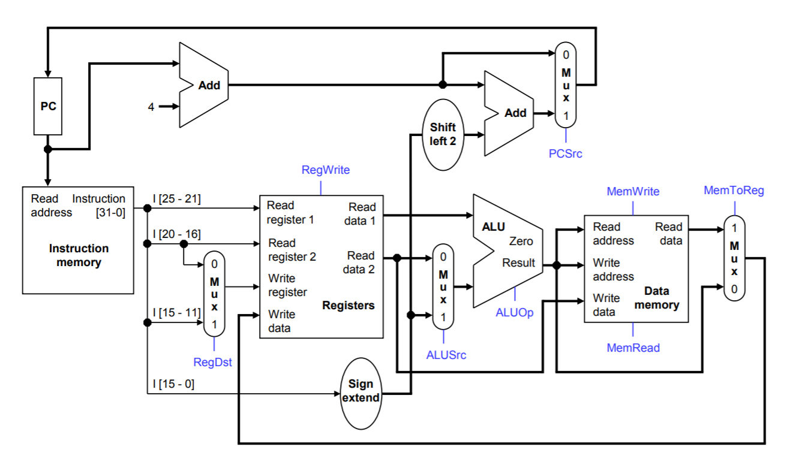

# mips

Verilog implementation of 32-bit MIPS processor supporting the instructions add, sub, and, or, slt, lw, sw, beq. Also included is a simple assembler written in Python.

## Supported Instructions

Instruction | Opcode | Funct | Syntax | Explanation
------------|--------|-------|--------|---------
add         |000000  |100000 |add $1, $2, $3 | $3 = $1 + $2
sub         |000000  |100010 |sub $1, $2, $3 | $3 = $1 - $2
and         |000000  |100100 |and $1, $2, $3 | $3 = $1 & $2
or          |000000  |100101 |or $1, $2, $3  | $3 = $1 \| $2
slt         |101010  |101010 |slt $1, $2, $3 | $3 = ($1 < $2)
lw          |100011  |       |lw $1 4($2)    | $1 = load($2 + 4)
sw          |101011  |       |sw $2 5($3)    | $2 = load($3 + 5)
beq         |000100  |       |beq $1, $2, 4  | jumps 4 instructions ahead if $1 == $2

## Datapath

## Credits

1. [Explanation of datapath for 32-bit single cycle MIPS processor](https://courses.cs.washington.edu/courses/cse378/09wi/lectures/lec07.pdf)

2. [Table of MIPS instructions and corresponding opcodes](https://uweb.engr.arizona.edu/~ece369/Resources/spim/MIPSReference.pdf)
